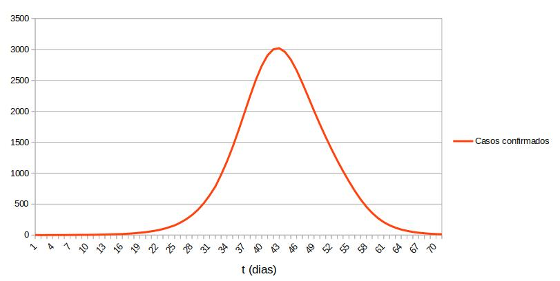

# Descrição do projeto

Para trabalharmos com o Covid Forecast, precisamos de um modelo que nos permita prever o número de casos de Covid-19. A partir disso, simularemos uma situação real para realizar essa previsão.

## Contexto real - Simulação

Imagine que teríamos um número ficticio de população que representasse a de uma cidade, onde todos são pessoas que não tiveram contato com o COVID-19.

Em um dia qualquer, essa população recebe duas pessoas que contrairam o COVID-19. Com isso poderemos aplicar o modelo matemático para prever o número de casos de Covid-19.

### Modelo:
```latex
x(t) = (x_0 * (n + x_0)) / (x_0 + ne^(-k * (n + x_0) * t)))
```
onde t é o tempo, x_0 é o números de casos iniciais, n é a população total e k é a constante de proporcionalidade.

### Aplicando o modelo:

Imagine uma cidade com uma população de 75.000 habitantes. Como a população é pequena, o número de casos iniciais e de 2. Porém, podemos levar em consideração que nem todos que estão nessa população serão infectados, portanto tomaremos 2/3 da população como pessoas que podem contrair o COVID-19.

Logo, temos que o valor de n = 50000, e o valor de x_0 = 2.

Levando em consideração que no momento x(0) = 2, e que a taxa de infecção é de que 1 pessoa contamina 2 em média por ciclo de contaminação (14 dias), então a cada dia, teremos em média 1.28 contaminados a cada 1 pessoa com o vírus, aplicando o modelo matemático, temos que encontrar o valor de k.

```latex
x(1) = (2 * 50002) / (2 + (50000 * e^(50002 * (-k) * 1))),
```
se x(0) = 2 então x(1) = 2 * 1.28, logo:

```latex
2.56 = (100004) / (2 + (50000 * e^(50002 * (-k) * 1)), 
```
portanto, k = 0.00000493723

Com a obtenção do valor de k, podemos aplicar o modelo em forma de script para simular o número de casos.

## O Script

Primeiramente criei duas constantes que representavam o número populacional e a constante de proporcionalidade:

```javascript
const POPULATION = 50000;
const RATE = -0.00000493723;
```
A partir dessa informação, criei uma função que recebe um número de dias e retorna o número de casos:
```javascript
function forestCovid(d) {
  // Todos o script...
}
```
Dentro da função a primeira coisa que fiz foi criar uma condicional onde eu possa verificar os valores para d <= 0.
```javascript
const dataDays = [];
  if (d <= 0) {
    return dataDays;
  }
```
A partir daí, eu criei um loop que vai de 0 até o valor de d, onde a cada passagem do loop, era alterado o valor de t dentro do modelo matemático, e eu fiz a diferença entre o valor de t e t + 1, para que o valor adicionado ao array, fosse exatamente o número de caso daquele dia em questão.
```javascript
const dataDays = [];
  if (d <= 0) {
    return dataDays;
  }

  for (let i = 0; i < d; i++) {
      const result =
        Math.floor(
          100004 / (2 + 50000 * Math.exp((POPULATION + 2) * RATE * (i + 1))),
        ) -
        Math.floor(
          100004 / (2 + 50000 * Math.exp((POPULATION + 2) * RATE * i)),
        );

      const total = Math.floor(
        100004 / (2 + 50000 * Math.exp((POPULATION + 2) * RATE * (i + 1))),
      );

      dataDays.push(`${i + 1} -> ${result}, total de casos: ${total}`);
  }

  return dataDays;
```
Com isso já teriamos um array com os valores de casos, e podemos imprimir os valores de casos na tela. Porém esse modelo matemático tem uma tendencia de crescimento exponencial, ou seja, a medida que o valor de d aumenta, o número de casos sempre irá tender ao tamanho total da população.

Pensando nisso, o fato de termos pego somente 2/3 da população já removeria essa limitação, garantindo que somente os 2/3 seriam infectados com o passar do tempo.

Para adicionar mais complexidade ao código, levei em consideração uma variável importante na hora de fazer esse cálculo, o número de pessoas que param de infectar após 14 dias com o vírus, então fiz essa implementação dentro do código:
```javascript
  const dataDays = [];
  const peopleCured = [];
  if (d <= 0) {
    return dataDays;
  }

  for (let i = 0; i < d; i++) {
    if (i < 13) {
      const result =
        Math.floor(
          100004 / (2 + 50000 * Math.exp((POPULATION + 2) * RATE * (i + 1))),
        ) -
        Math.floor(
          100004 / (2 + 50000 * Math.exp((POPULATION + 2) * RATE * i)),
        );

      const total = Math.floor(
        100004 / (2 + 50000 * Math.exp((POPULATION + 2) * RATE * (i + 1))),
      );

      dataDays.push(`${i + 1} -> ${result}, total de casos: ${total}`);

      peopleCured.push(result);
    } else {
      const total = Math.floor(
        (100000 - peopleCured[i - 13] * 2) /
          (2 +
            (50000 - peopleCured[i - 13]) *
              Math.exp((POPULATION - peopleCured[i - 13]) * RATE * (i + 1))),
      );

      const result =
        Math.floor(
          (100000 - peopleCured[i - 13] * 2) /
            (2 +
              (50000 - peopleCured[i - 13]) *
                Math.exp((POPULATION - peopleCured[i - 13]) * RATE * (i + 1))),
        ) -
        Math.floor(
          (100000 - peopleCured[i - 13] * 2) /
            (2 +
              (50000 - peopleCured[i - 13]) *
                Math.exp((POPULATION - peopleCured[i - 13]) * RATE * i)),
        );

      peopleCured.push(result);

      dataDays.push(`${i + 1} -> ${result}, total de casos: ${total}`);
    }
  }

  return dataDays;
```
Com isso, analisei os dados recebidos pelo script e fiz um gráfico que representa o crescimento no número de casos por dia:



Observando o gráfico, vemos que no dia 42 foi obtido o maior número de casos confirmados, e após isso a curva de contaminação começou a diminuir, pois grande parte da população de infectados já teriam sido curados e o número total de casos se aproximava do 2/3 da população.

## Testes
Todos os testes unitários foram feitos em Jest, leia o [README.md](/README.md) para mais informações.

## Referências bibliográficas:

- BOYCE, W. E.; DIPRIMA, R. C. _Equaçoes Diferenciais Elementares e Problemas de Valores de Contorno, 10a ediçao._ [S.l.: s.n.], 2018.
- STEWART, J. _Cálculo, Volume 1, 7a edição._ [S.l.: s.n.], 2013.
- STEWART, J.; REDLIN, L.; WATSON, S. _Precalculus: Mathematics for calculus._ [S.l.]: Cengage Learning, 2015.
- ZILL, D. G. _Equações diferenciais com aplicações em modelagem, 3a ediçao._ [S.l.]:Cengage Learning Editores, 2016.